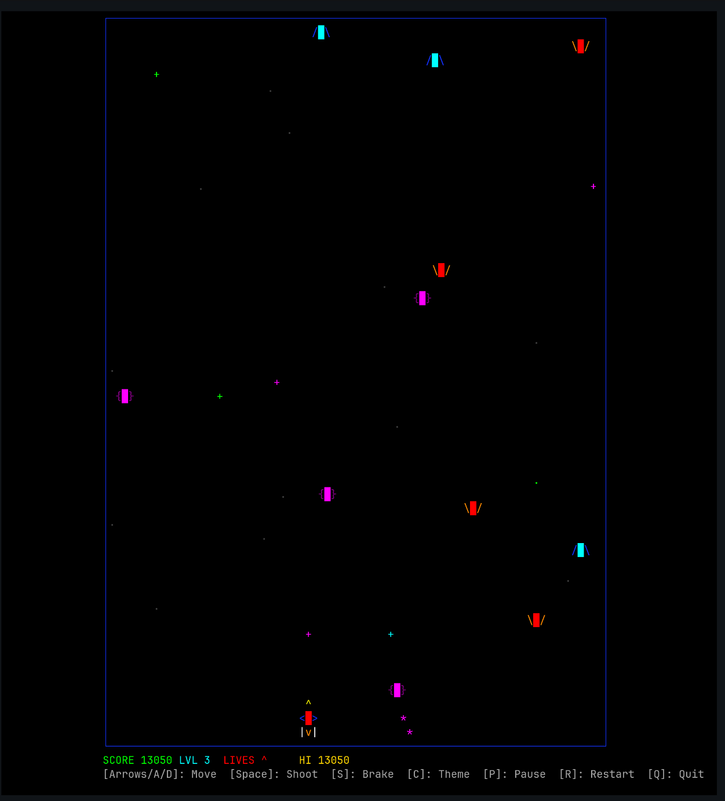

# Fakelaxian

A retro arcade shooter that runs entirely in your terminal — a tribute to Namco's
1979 classic **Galaxian**.

> Built as a **vibecoding** experiment: an AI-assisted, terminal-based game
> written in Rust.

## About

Fakelaxian is a terminal reimagining of **Galaxian**, the pioneering arcade
shooter released by Namco in 1979. Instead of pixels on a CRT, it paints a
colorful play field directly inside your terminal emulator using Unicode block
characters — no graphics library, no GPU, no windowing system.

The project is also a **vibecoding test**: a game conceived and iterated on with
the help of AI coding tools, exploring how far "vibe" plus Rust plus the
terminal can go.



## Features

- Title screen before starting
- Player ship with smooth, inertia-based movement
- Multiple enemy types (Drone, Hornet, Emissary, Boss) with distinct behaviors
- Enemy formation movement and diving attacks
- Shooting with a bullet limit and fire-rate control
- Collision detection with particle explosion effects
- Score, lives, extra lives (every 5,000 points) and level progression
- Persistent high score and theme selection across sessions
- Game states: title, playing, paused, game over
- Seven selectable color themes
- Fixed 30 Hz game logic with interpolated rendering (up to ~60 Hz)
- Restores the terminal cleanly on exit and even on panic

## Controls

| Key | Action |
| --- | --- |
| `Space` / `Enter` | Start the game (from the title screen) / shoot |
| `←` `→` (or `A`/`D`) | Move the ship |
| `S` (or `↓`) | Brake (instant stop) |
| `C` | Cycle color theme |
| `P` | Pause / resume |
| `R` | Restart |
| `Q` / `Esc` / `Ctrl-C` | Quit |

## Requirements

- A terminal emulator with Unicode support (Konsole, GNOME Terminal, Ghostty, iTerm2, …)
- A terminal of at least **40×15** characters (80×30 recommended)
- **Rust 1.70+** — only needed to build from source

## Installation

### 1. Install Rust (skip if already installed)

```bash
curl --proto '=https' --tlsv1.2 -sSf https://sh.rustup.rs | sh
source "$HOME/.cargo/env"
```

### 2. Get the code

```bash
git clone https://github.com/HardAndJoyless/Fakelaxian.git fakelaxian
cd fakelaxian
```

### 3. Build and run

```bash
cargo run --release
```

or, with the provided convenience script (builds and launches in one step):

```bash
./run.sh
```

### Optional: install the binary system-wide

```bash
cargo install --path .
```

This installs the `fakelaxian` command into `~/.cargo/bin` (added to your
`PATH` automatically by rustup). After that, simply run:

```bash
fakelaxian
```

To remove it later:

```bash
cargo uninstall fakelaxian
```

## Gameplay

1. Press `Space` on the title screen to start
2. Destroy every enemy ship before they reach the bottom
3. Watch for diving enemies — they break formation and attack directly
4. Avoid enemy bullets and collisions
5. Boss enemies are worth the most points
6. Clear the wave to advance to the next level
7. Earn an extra life every 5,000 points

## Notes on the rendering

The play field uses a ~3:2 cell width-to-height ratio. Because terminal cells
are roughly twice as tall as they are wide, this produces a visual aspect ratio
close to the original arcade cabinet's ~3:4 (portrait) orientation.

Game logic runs at a fixed 30 Hz timestep, while rendering is decoupled and
interpolates positions between ticks for smoother motion at up to ~60 Hz.

## Persistence

The high score is saved to `~/.fakelaxian_highscore` and the selected theme to
`~/.fakelaxian_palette`.

## Development

```bash
cargo check    # Check for compilation errors
cargo run      # Run in debug mode
cargo test     # Run the unit tests
cargo clippy   # Lint the code
cargo fmt      # Format the code
```

## License

MIT — see the [LICENSE](LICENSE) file for details.

## Credits

Inspired by the classic 1979 arcade game *Galaxian* by Namco.
